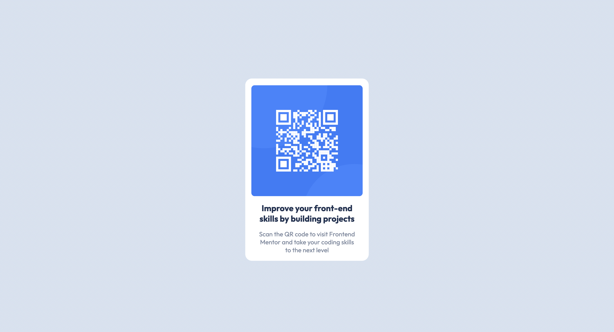
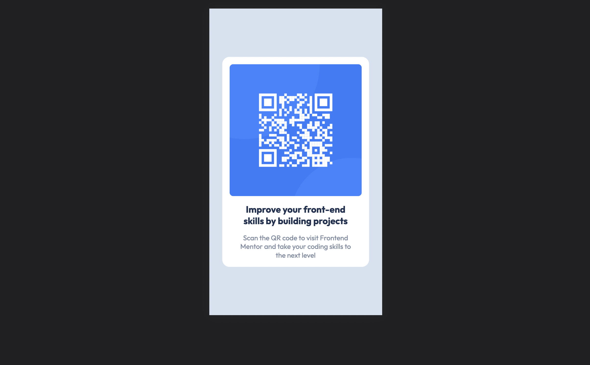

# Frontend Mentor - QR code component solution

This is a solution to the [QR code component challenge on Frontend Mentor](https://www.frontendmentor.io/challenges/qr-code-component-iux_sIO_H). Frontend Mentor challenges help you improve your coding skills by building realistic projects. 

## Table of contents

- [Overview](#overview)
  - [Screenshot](#screenshot)
  - [Links](#links)
- [My process](#my-process)
  - [Built with](#built-with)
  - [Useful resources](#useful-resources)
- [Author](#author)
- [Acknowledgments](#acknowledgments)

## Overview

This is my first project here in Frontend Mentor

### Screenshot

- A Desktop version

- A Mobile Version

### Links

- Solution URL: [Add solution URL here](https://warsayt.github.io/FrontEndMentor-QR-Code/)

## My process

### Built with

- Semantic HTML5 markup
- CSS custom properties
- Flexbox
- CSS Grid
- Mobile-first workflow

### Continued development

I want to improve my css knowledge in the future.

### Useful resources

- [Example resource 1](https://developer.mozilla.org/en-US/docs/Web/CSS) - CSS mdn

## Author

- Website - [Warsay Teklebrhan Asresehey](https://portfolio-react-warsay.vercel.app)
- Frontend Mentor - [@WarsayT](https://www.frontendmentor.io/profile/WarsayT)
- Twitter - [@WTeklebrhan](https://www.twitter.com/yourusername/WTeklebrhan)

